# MySql

> 参考

学术界的数据结构可视化学习：https://www.cs.usfca.edu/~galles/visualization/Algorithms.html

mysql官方文档（推荐）：

* https://dev.mysql.com/doc/
* 文档索引 https://dev.mysql.com/doc/index-other.html
* https://dev.mysql.com/doc/internals/en/

http://www.ruanyifeng.com/blog/2014/07/database_implementation.html

http://blog.codinglabs.org/articles/theory-of-mysql-index.html


## 基础

### 文件目录

以文本形式保存

所有的数据库文件都存在data目录下，一个文件夹就对应一个数据库

本质还是文件的存储

MySQL 引擎在物理文件上的区别


### 数据类型

int  4B


## MySQL 架构


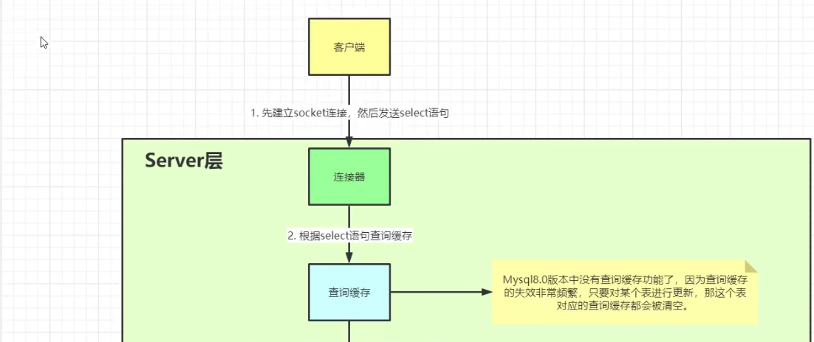

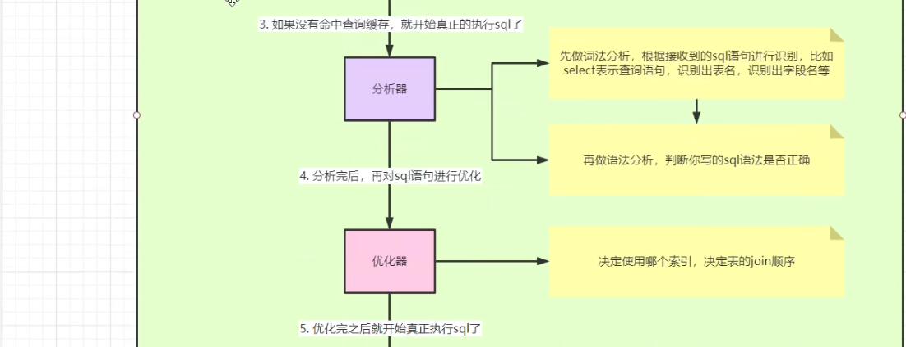 

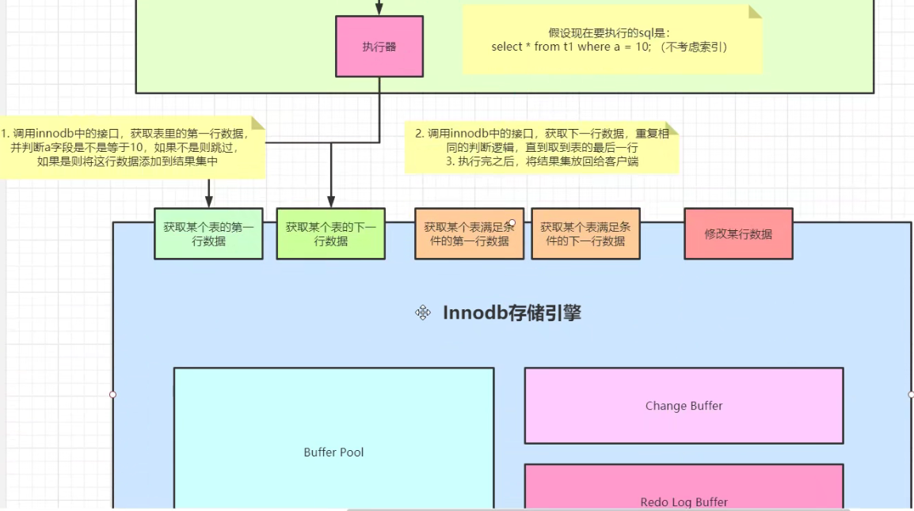


## 操作数据库

操作数据库》操作数据库中的表》操作数据库中表的数据

==MySQL不区分大小写==

2.1操作数据库
1.创建数据库

```sql
CREATE DATABASE if not EXISTS `demo`;
CREATE DATABASE jdbcStudy CHARACTER SET utf8 COLLATE utf8_general_ci;
```


2.删除数据库

```sql
DROP DATABASE IF EXISTS `demo`;
```


1
3.使用数据库

-- ``,如果你的表名或者字段名是一个特殊字符，需要带``

USE 'school'
4.产看数据库

SHOW DATABASES--查看所有数据库


### 编码

utf8mb4 与 utf-8 的区别


*-- 关于数据库引擎* */\* INNODB 默认使用 MYISAM 早些年使用  \*/*


|                                | MYISAM | INNODB                 |
| ------------------------------ | ------ | ---------------------- |
| 事务支持                       | 不支持 | 支持                   |
| 数据行锁定                     | 不支持 | 支持                   |
| 外键约束                       | 不支持 | 支持                   |
| 全文索引（查询文章中的关键字） | 支持   | 不支持                 |
| 表空间的大小                   | 较小   | 较大，约为MYISAM的两倍 |

常规使用操作：

- MYISAM 节约空间，速度较快，
- INNODB 安全性高，事务处理，多表多用户操作


### Explain详解


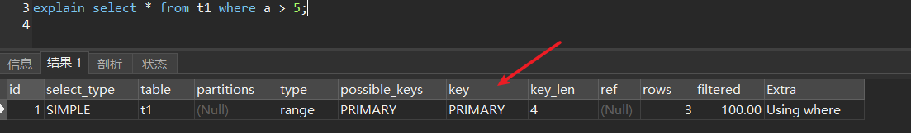

explain 判断语句是否走了索引，key = primary 表示该语句走了主键索引


SQL 性能优化的目标：至少要达到 range 级别， 要求是 ref 级别， 如果可以是 consts
最好。
说明：
1） consts 单表中最多只有一个匹配行（主键或者唯一索引） ，在优化阶段即可读取到数据。
2） ref 指的是使用普通的索引（normal index） 。
3） range 对索引进行范围检索。
反例： explain 表的结果， type=index，索引物理文件全扫描，速度非常慢，这个 index 级别比较 range 还低，与全表扫描是小巫见大巫。

type=all 全表扫描  


## 范式

* 第一范式（1NF）

    原子性：保证每一列不可再分

* 第二范式（2NF）

    前提：满足第一范式

    每张表只描述一件事情

* 第三范式（3NF）

    前提：满足第一范式和第二范式

    第三范式需要确保数据表中的每一列数据都和主键直接相关，而不能间接相关。


## 测试数据

```sql
drop table t1 if exists;

create table t1 (
	a int primary key,
	b int,
	c int,
	d int,
	e varchar(20)
) engine=InnoDB

create index idx_t1_bcd on t1(b,c,d);
create index idx_t1_e on t1(e);  # varchar 建索引

select * from t1;

insert into t1 values(4,3,1,1,'d');
insert into t1 values(1,1,1,1,'a');
insert into t1 values(8,8,1,1,'h');
insert into t1 values(2,2,1,1,'b');
insert into t1 values(5,5,1,1,'e');
insert into t1 values(3,3,1,1,'c');
insert into t1 values(7,7,1,1,'g');
insert into t1 values(6,3,1,1,'f');
```


## 隐式转换

```sql
select 2=2;  # 1, 表示相等
select '0'='a'; # 0
select 0='a'; # 1
select 1='a'; # 0
select 1='1'; # 1
select 0='abc'; # 1
select 0='0abc'; # 1
select 1='1abc'; # 1
select 12='12abc'; # 1
select 12='ab12c'; # 0
select 12='abc12'; # 0
```


mysql 对于类型不匹配时，会进行隐身转换。

==当等式两边出现数字和字符时，一律只将字符转为数字==，不管字符是字段还是等式的任一边，都会转换。

* 'abc' 转为 0
* '12abc' 转为 12
* '12' 转为 12


> 危险的隐身转换

当数据库含 0 时，发生隐身转换可能会带来 bug

例1：

```sql
where e = 1 # 若 e 是字符，那么 e 会根据规则转为数字，e 兜底是 0，导致业务逻辑错误 
```

当 e 还是索引时，会导致索引树先转换（可能导致转换错误和排序错误），然后再进行==比较==，无法保证是一个可以正确的索引树。所以在这种情况下，mysql 不会走索引。


例2：

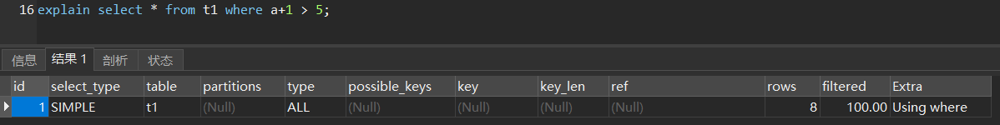

目前在mysql 5.7 中，只要对字段做了运算，mysql 就不会走索引，因为无法保证运算/转换后的索引树是否还正确。


等式右边运算可以正常走索引

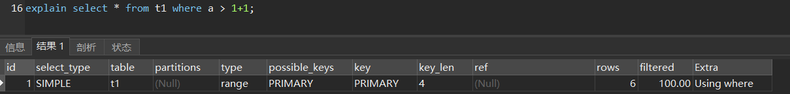


## 索引

> 参考：

索引（Index）是帮助MySQL高效获取数据的==排好序==的==数据结构==


### 为什么要有索引

没有索引，就会全表扫描，效率极低。


| 查询策略   | 复杂度 | 依赖       |
| ---------- | ------ | ---------- |
| 顺序查找   | O(n)   |            |
| 二分查找   |        | 数据有序   |
| 二叉树查找 |        | 二叉查找树 |


查询策略依赖数据本身，但是数据本身的组织结构不可能完全满足各种数据结构（例如，理论上不可能同时将两列都按顺序进行组织），所以，在数据之外，数据库系统还维护着满足特定查找算法的数据结构，这些数据结构以某种方式引用（指向）数据，这样就可以在这些数据结构上实现高级查找算法。这种数据结构，就是索引。


数据库以B树格式储存，只解决了按照"主键"查找数据的问题。如果想查找其他字段，就需要建立索引（index）。

所谓索引，就是以某个字段为关键字的B树文件。假定有一张"雇员表"，包含了员工号（主键）和姓名两个字段。可以对姓名建立索引文件，该文件以B树格式对姓名进行储存，每个姓名后面是其在数据库中的位置（即第几条记录）。查找姓名的时候，先从索引中找到对应第几条记录，然后再从表格中读取。

这种索引查找方法，叫做["索引顺序存取方法"](http://en.wikipedia.org/wiki/ISAM)（Indexed Sequential Access Method），缩写为ISAM。它已经有多种实现（比如C-ISAM库和D-ISAM库），只要使用这些代码库，就能自己写一个最简单的数据库。


#### 慢SQL

慢SQL几秒或几十秒都

扫描的行数过大，看下索引是否合适

没有索引的时候，从表的第一行开始扫描，代表一次 IO 交互

### 数据结构

> 参考


> 索引的数据结构

* 二叉树
* 红黑树
* Hash表
* B- Tree

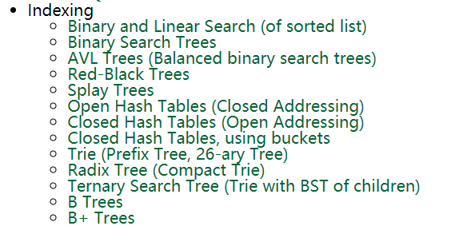·

适合做索引的数据结构有很多，那么 mysql 到底选用的是哪一种呢？


#### 二叉树

二叉查找树（Binary search tree）

	


二叉查找树的特点：

（1）每个节点最多只有两个子树。

（2）左子树都为小于父节点的值，右子树都为大于父节点的值。

（3）在n个节点中找到目标值，一般只需要log(n)次比较。


缺点：

* 在某些情况下，二叉树会变成类似链表！如果查询叶子节点，比对的次数较多


#### 红黑树

即平衡二叉树（AVL）

名字由来：历史原因由于作者的颜色喜好

演变由来：在某些情况下，二叉树会变成类似链表！如下图：


​	

上面这棵二叉树的查询效率就低了。因此若想二叉树的查询效率尽可能高，需要这棵二叉树是平衡的


平衡二叉树特点：

* 满足二叉查找树
* 任何节点的两个子树的高度最大差为1
* 不要求有序
* 一个节点只能容纳一个值


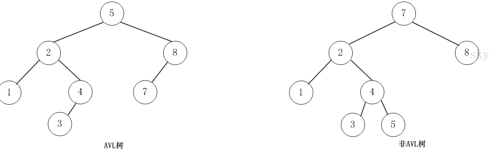

当平衡二叉树通过插入或删除后，可能会导致不平衡，这时候可通过旋转来恢复平衡。

缺点：

* 在数据量大的情况下，树的高度会比较高，如果查询叶子节点，比对的次数会比较多


#### B-Tree（B树）

世界上没有 “B减树”，B - Tree 中间是破折号，叫做 B树

平衡多路查找树

* 平衡的
* 多路的 - 多叉树

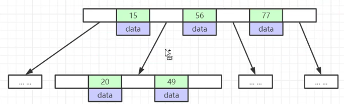	

特点：

* 排好序的，节点中的数据索引从左到右递增排列，同一个节点若有多个元素，也是排好序的。
* 一个节点可以容纳多个值（元素）— 单节点存放更多的索引
* 除非数据已经填满，否则不会增加新的层。也就是说，B树追求"层"越少越好。
* 叶节点具有相同的深度，叶节点的指针为空
* ==所有索引元素不重复==


B-Tree是为磁盘等外存储设备设计的一种平衡查找树。将相关数据尽量集中在一起，以便一次读取多个数据，减少硬盘操作次数。


子节点中的值，与父节点中的值，有严格的大小对应关系。一般来说，如果父节点有a个值，那么就有a+1个子节点。比如上图中，父节点有两个值（7和16），就对应三个子节点，第一个子节点都是小于7的值，最后一个子节点都是大于16的值，中间的子节点就是7和16之间的值。

这种数据结构，非常有利于减少读取硬盘的次数。假定一个节点可以容纳100个值，那么3层的B树可以容纳100万个数据，如果换成二叉查找树，则需要20层！假定操作系统一次读取一个节点，并且根节点保留在内存中，那么B树在100万个数据中查找目标值，只需要读取两次硬盘。


> 磁盘知识

系统从磁盘读取数据到内存时是以磁盘块（block）为基本单位的，位于同一个磁盘块中的数据会被一次性读取出来，而不是需要什么取什么。

InnoDB存储引擎中有页（Page）的概念，页是其磁盘管理的最小单位。InnoDB存储引擎中默认每个页的大小为16KB，可通过参数innodb_page_size将页的大小设置为4K、8K、16K，在[MySQL](http://lib.csdn.net/base/mysql)中可通过如下命令查看页的大小：

```sql
mysql> show variables like 'innodb_page_size';
```

而系统一个磁盘块的存储空间往往没有这么大，因此InnoDB每次申请磁盘空间时都会是若干地址连续磁盘块来达到页的大小16KB。InnoDB在把磁盘数据读入到磁盘时会以页为基本单位，在查询数据时如果一个页中的每条数据都能有助于定位数据记录的位置，这将会减少磁盘I/O次数，提高查询效率。


B-Tree 结构的数据可以让系统高效的找到数据所在的磁盘块。

为了描述B-Tree，首先定义一条记录为一个二元组[key, data] ，key为记录的键值，对应表中的主键值，data为一行记录中除主键外的数据。对于不同的记录，key值互不相同。


data 记录记录所在磁盘文件地址

​	


分析上面过程，发现需要3次磁盘I/O操作，和3次内存查找操作。由于内存中的关键字是一个有序表结构，可以利用二分法查找提高效率。而3次磁盘I/O操作是影响整个B-Tree查找效率的决定因素。B-Tree相对于AVLTree缩减了节点个数，使每次磁盘I/O取到内存的数据都发挥了作用，从而提高了查询效率。


==注意==，但 mysql 底层用的也不是完全的 B树


#### B+Tree（B加树）

B+Tree是在B-Tree基础上的一种优化，使其更适合实现外存储索引结构，InnoDB存储引擎就是用B+Tree实现其索引结构。


特点

* 一个节点里有多个元素
* 非叶子节点的数据都冗余在叶子节点上，即叶子节点包含所有索引字段
    * 非叶子节点不存储 data，只存储索引（冗余），可以存放更多索引，降低树的高度
* （msyql 对 B+树再次优化）叶子节点之间有双向指针，提高区间访问的性能
    * 索引有序，即便索引本身不是有序的，B+ 树也能使其有序
    * 以范围查询为例，col > 20 ，先找到20，然后不再查找，直接平行获取相邻的元素


下图是学术的B+树，mysql 在此基础上，增加了双向指针

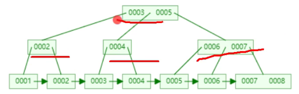	


> B+树空间使用

mysql 对一页数据的大小

```sql
show global status like 'Innodb_page_size';  # 16384 ，16kb 的大小
```

一页索引个数公式   16KB / (8B + 6B) = 1170

B+树的叶子节点能容纳元素数量，公式 1170 x 1170 x 16  = 2千万


新版版中的 mysql 是提前把索引树（除了叶子节点）加载到内存了，只有一次 IO load 。


> 磁盘读取知识

CPU 读取磁盘是按照 页 的单位读取


一般来说，索引本身也很大，不可能全部存储在内存中，因此索引往往以索引文件的形式存储的磁盘上。这样的话，索引查找过程中就要产生磁盘I/O消耗，相对于内存存取，I/O存取的消耗要高几个数量级，所以评价一个数据结构作为索引的优劣最重要的指标就是在查找过程中磁盘I/O操作次数的渐进复杂度。换句话说，索引的结构组织要尽量减少查找过程中磁盘I/O的存取次数。下面先介绍内存和磁盘存取原理，然后再结合这些原理分析B-/+Tree作为索引的效率。


#### Hash

mysql 索引存储结构除了 B树还有 Hash

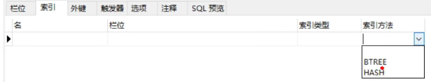	


Hash 的数据结构是数组 + 链表

Hash 算法：MD5，CRC 16，CRC 32


> 插入流程

对索引的key进行一次hash计算就可以定位出数据存储的位置（数组中的位置）


Hash 的特点

* 缺点：不支持范围查询（大于、小于），仅支持 =，in ，导致实际场景用的很少
* 优点：查询效率高


> 插入顺序与读取不一致？

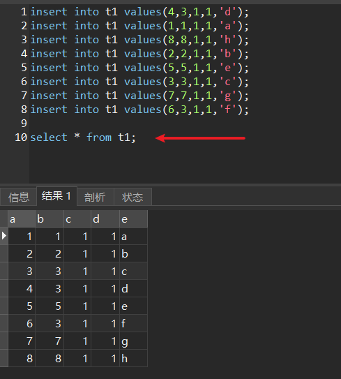	

innodb在插入的时候就在排序了


### 逻辑分类

* 主键索引 （PRIMARY KEY）
    唯一的标识，主键不可重复，只能有一个列作为主键
* 唯一索引 （UNIQUE KEY）
    避免重复的列出现，唯一索引可以重复，多个列都可以标识唯一索引
* 常规索引（KEY/INDEX）
    默认的，index,key关键字来设置
* 全文索引（FULLTEXT）
    在特定的数据库引擎下才有，MyISAM 快速定位数据


### 覆盖索引

能够建立索引的种类分为主键索引、唯一索引、普通索引三种，而覆盖索引只是一种查询的一种效果，用 explain 的结果， extra 列会出现： using index。  


### 索引下推

底层原理和执行流程


### 索引准则

- 索引不是越多越好
- 不要对经常变动的数据加索引
- 小数据量的表不需要加索引
- 索引一般加在常用来查询的字段上


判断索引是否会用到的一个准则：当前索引列是否有序


mysql 如何选择最优索引的？


mysql 有哪些索引失效的情况


亿级流量下的mysql 索引优化策略


一线大厂为什么要基于mysql 开发自研数据库


### 创建索引


```sql
# 全字段索引
mysql> alter table <table_name> add index index1(email);

# 前缀索引，阿里巴巴规范推荐
# 长度和区分度的公式 count(distinct left(列名, 索引长度))/count(*)  比例在 90% 以上即可
mysql> alter table <table_name> add index index2(email(6));
```


#### 何时没有建索引的意义

当一个表里只有一列字段，且是 varchar 类型。此时索引树中的索引页存储的还是该varchar字段，冗余，且字符串没有范围比较一说吧。


#### 前缀索引

优化字符类型的索引创建

用列的前缀代替整个列作为索引key，当前缀长度合适时，可以做到既使得前缀索引的选择性接近全列索引，同时因为索引 key 变短而减少了索引文件的大小和维护开销。

场景1：网址

www.baidu.com

www.google.com

```sql
alter table employees.employees add index `first_name_last_name4` (first_name, last_name(4));
```


## 存储引擎 InnoDB

==存储引擎是表级别的==


### 架构图

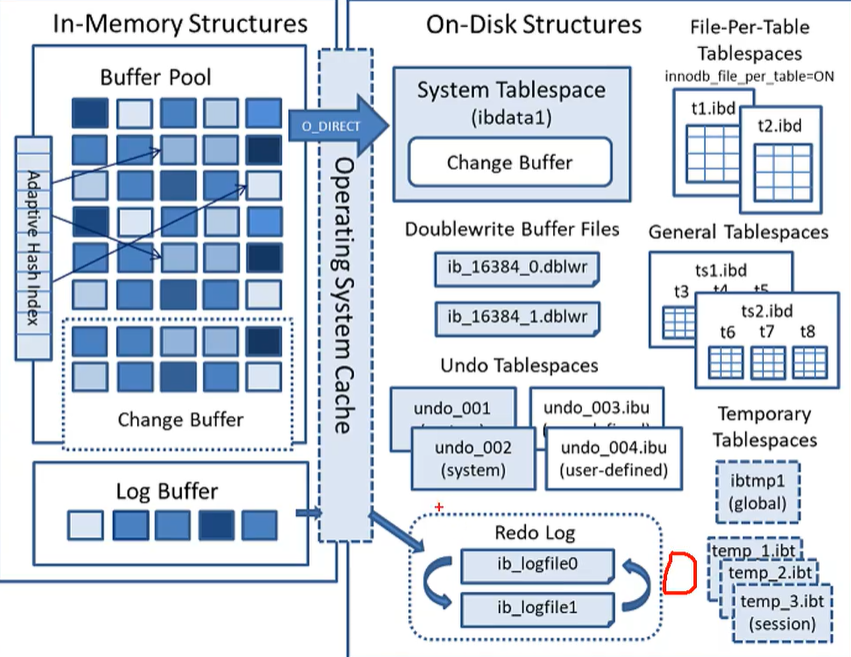	

### 页是基本单位

页：存取的基本单位（最小单位）

Innodb 存储引擎，从磁盘文件读取数据是按照最小单位“页”来读取的。

```sql
show global status like 'Innodb_page_size';  # 默认页大小 16384B，16 * 1024 = 16KB
```

一页的大小是 16KB，只要得到行记录字节大小，就可以计算出一页可以读取行记录数

如果行记录大小为20B，那么一页能读取 800 行


> 触类旁通

操作系统也需要从磁盘中取数据，操作系统也有"页"，一页有 4KB

页的概念来自：局部性原理，减少磁盘 IO 次数


### 页的结构

	


> 用户数据区域

特点

* 插入时进行排序
    * 排序规则：主键（升序） > 唯一索引 > rowid（生成隐藏的自增id作为主键）
    * 为什么要排序？有序的形式，能在查询时快速知道这页有没有符合要求的数据
* 链表结构
    * 优点：有利于插入，但建议用整形且自增id作为主键，尾端插入效率更高
    * 缺点：链表在大范围遍历时效率低（解决方法：页目录）


> 页目录

链表查询效率低，所以缩小用户数据查找范围。页目录就是对该页的用户数据进行分组，每一组存储该组内最小记录位置指针和主键值。让查询只在可能的分组中进行，提高查询效率。

一个页目录大概占 10B

mysql 中一页的分组是 6 条行记录

优化思想：空间换时间


> 页指针

当一页16KB满了之后，会新开一页。如果此时插入的数据主键不是有序的，那么得至少调整两个页的内容。

页与页之间存在双向指针

同一组页包含了相同逻辑的数据，必然是相邻的


### B+树雏形

开辟一个页空间用来记录各个页的最小值，用于快速定位页。

​			1600（页数量） * 6（每页6条记录）  = 10000

依然是空间换时间的思想


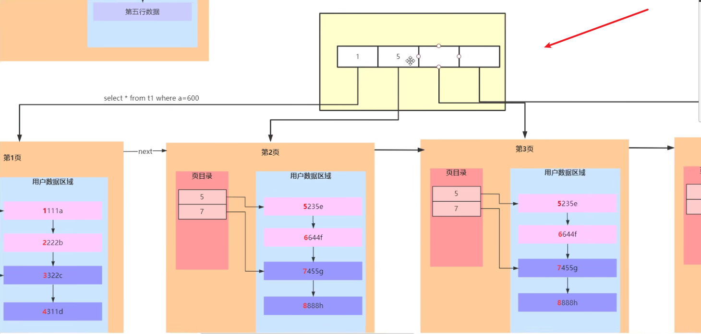


> 索引页和数据页

索引页：非叶子节点 ——  用于提高查询速度的，优化思想是空间换时间

数据页：叶子节点

聚集索引（纯概念）：索引页和数据页在一个结构中的索引结构。在 mysql 中主键索引可以叫做聚集索引。


> 执行流程

在B+树从上往下查找，表示走了索引；

在B+树的数据页之间从左往右查找，表示未走索引；我们称之为全表扫描，基于主键索引树（因为数据记录仅在主键索引树上）


### 例子

例子1：

假设 a 字段是主键索引

```sql
select * from t where a = 600000;
```

* 先读取一个页空间，用于存储页信息，包含每个页的最小值
* 通过查询主键定位出指定的页
* 从磁盘读取该页数据
* 通过页的页目录定位到指定的分组
* 得到该条数据


例子2：


where a=1

如果没有“页”，且没有索引，那么读取 IO 次数等同于 行记录数！


### 联合索引

由多个字段，按需组成的索引

> 联合索引底层存储结构

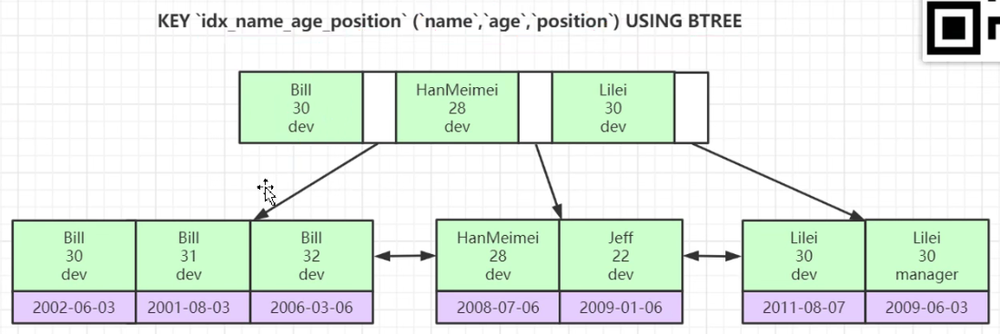


> B+ 树是排好序的，那么联合索引如何排序

根据建立字段的先后顺序，逐个比较。==字符串类型按照字符逐位来比较==


#### 回表

通过主键在主键表中找到那条记录的完整值


#### 最左前缀原则

只要给到==联合索引的第一个字段==就能走索引，否则就会全表扫描

```sql
key `idx_name_age_position` (`name`, `age`, `position`) using btree

explain select * from employees where name = 'Bili' and age = 31;  	# 会走索引
explain select * from employees where age = 30 and position='dev'; 	# 不会走	
explain select * from employees where position='manager';			# 不会走

# 索引 b_c_d
explain select * from t1 where b=1 and d=4; #走索引
explain select * from t1 where b>1; # 不走索引
```


#### 索引不一定比全表扫描快

联合索引 b_c_d ，explain 发现 b > 1 时，MySQL 选择了全表扫描，而没有走索引（联合索引）。因为 MySQL 发现在 b> 1的场景下，虽然命中了联合索引，但是要把整个联合索引，从左到右读取，且需要回表操作；不如直接到主键索引树，全表扫描来得快。

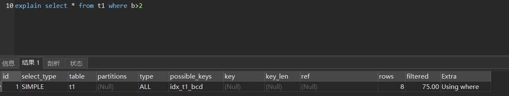


#### 判断是否走索引

==注意==，不是命中了索引，就一定会走索引；MySQL会通过查询优化器来判断最终是否走索引

判断指标：

* 排序效率
* 回表效率
* 


已知：b_c_d 是联合索引；a 是主键。

例1：指定了 select 的值，当这些值存在于联合索引树中，就无需回表了，所以会走索引（其中 联合索引值的部分存储了主键值）

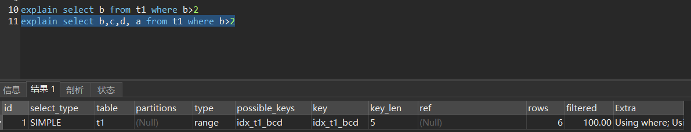


例2：

e 不存在联合索引树中，需要回表

b>2 又覆盖了所有的页

综上 mysql 选择了全表扫描

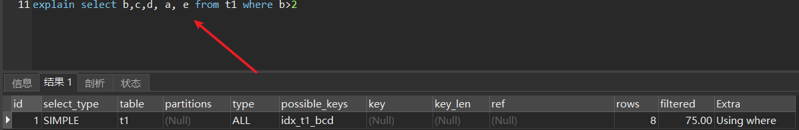


例3：

select b，没有where 条件，能走索引

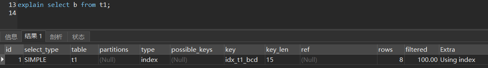

分析：

1. 在没有 where 条件下，MySQL要么从联合索引树从左往右查，要么从主键索引树从左往右（即全表扫描）
2. 因为联合索引中包含了 b 值（select指定值），无需回表，满足了基本要求；
3. 由因为联合索引中没有存储完整的记录，一页空间可容纳的索引值更多，整体的叶子节点要少很多

所以，联合索引读取页的次数更少，减少了 IO 次数，和降低了加载内存


例4：

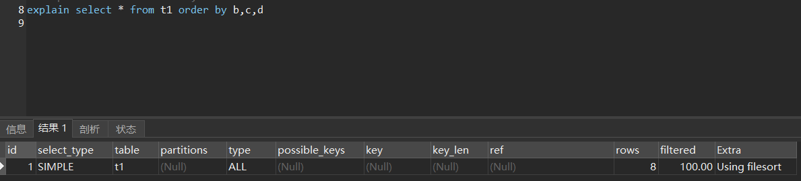

走索引，不需要排序，要回表

全表扫描，需要排序，不需要回表

查询优化器会==根据实际行记录数==分析，具体需要看优化器的日志。


### 查询优化器

MySQL能智能判断是否走索引


### 最终B+树

> 当一个表既有主键索引，又有联合索引时，B+树是如何构造的？

已知主键索引的B+树，是包含索引页和数据页的。

而联合索引的B+树，叶子节点中的数据记录被替代为主键，通过该主键来获取完整的值。从而避免了数据记录的冗余，以及修改数据时的能效。


> 小结

顺序是可优化的基础


索引底层原理和执行流程


特点

* 表数据文件本身就是按 B+ Tree 组织的一个索引结构文件
* 聚集索引/聚簇索引 —— 叶节点包含了完整的数据记录，所以查找效率更高
* 页作为磁盘和内存之间交互的基本单位
* Mysql 默认存储引擎，5.5 版本后
* 应用场景：事务性、安全性操作较多的情况下


innoDB 在数据库表文件

* *.frm 文件 —— frame：表结构
* *.ibd 文件 —— 存放 索引 + 数据，结构就是一个 B+ 树


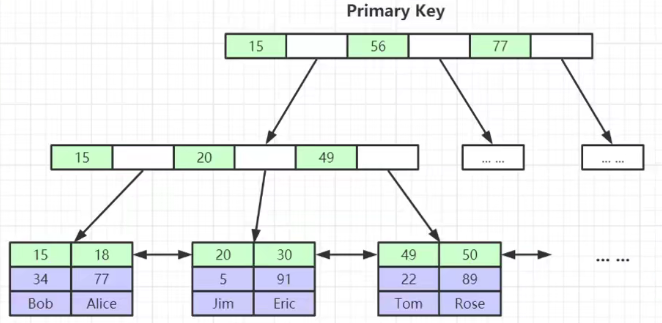	


> Innodb 表与 myisam 表的区别

|               | Myisam                                  | Innodb             |
| ------------- | --------------------------------------- | ------------------ |
| B+ 树         | 是                                      | 是                 |
| B+ 树叶子节点 | 叶子节点存放索引对应data 的文件磁盘地址 | 存放行记录数据本身 |
| 主键索引      | 非聚集索引/稀疏索引                     | 聚集索引/聚簇索引  |


### InnoDB 架构

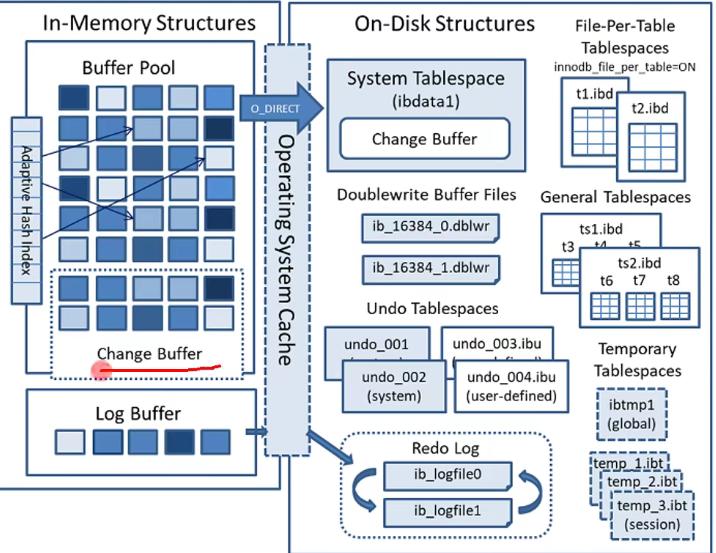	


### 常用配置

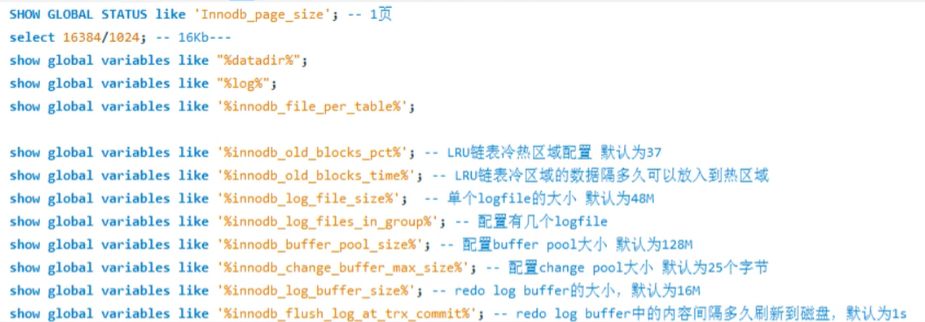	


### Buffer Pool

从磁盘读取的文件放到MySQL单独的内存区域，Buffer Pool。

InnoDB是C写的，在内存区域开辟了一个固定大小的数组空间；5.7.5后可在服务器运行过程中调整大小

下文简称（BF）


#### 内存结构

* 页区域：mysql 启动时==开辟==128M的连续数组空间，数组元素默认是空的
    * 一个页大小，默认 16KB
* free 链表：管理空闲页
* flush链表：管理脏页（数据结构与 free 链表相同）
* LRU链表：数据结构同 Free 链表


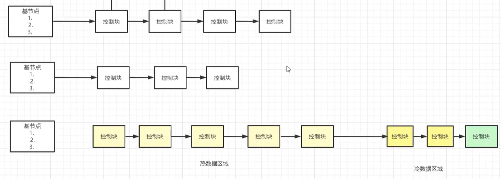


#### DQL 

先确保 BF 中已存在该页，若不存在则从硬盘拷贝该页到 BF 中。


#### DML

* 先确保 BF 中已存在该页，若不存在则从硬盘拷贝该页到 BF 中
* 直接更新 BF 中的页
* 根据 LRU 规则，进行持久化


#### 脏页

定义：在BF 中已修改但未持久化的页


#### 持久化时机

MySQL有一个线程会==定时==扫描 flush 链表，来持久化脏页；

持久化后，Buffer Pool 会出现空闲的页区域


#### 空闲区域管理

free链表，管理空闲区域

free链表结构：

* 基结点（头部节点）：记录了首、尾、空闲块的个数
* 控制块（空闲块）：记录了指针，指向空闲的页地址

流程：

* 当BF中有新的空闲页时，会以控制块的方式插入到 free 链表的末端
* 当读取新的页到BF中时，会插入到 free 链表第一个控制块指向的位置，并且将该控制块从链表中移除


#### LRU

Least Recently Used的缩写，即最近最少使用

将最近访问（热点数据页）的放到头部，将最少访问的放到尾部，先淘汰尾部

缺陷：当进行误操作一次全表扫描时，可能由于大数据量会淘汰掉有效的数据页的控制块

优化：

* 将链表分为两段：热数据区域（5/8）、冷数据区域（3/8）；
    * 热数据区域，用来存放使用频率高的数据页
    * 冷数据区域，用来存放使用频率不高的数据页
    * 通过 `innodb_old_blocks_pct`可以调整区域比例
* 新页先进入冷数据区域的头部
* 若冷数据区域的页面，同一个页的两次访问间隔大于 1s ，则将该页移到热数据区域的头部。


> 为什么1秒

就是为了针对全表扫描的场景，当页已经在内存中后，重复读取的间隔一般是小于 1s 的。


#### Change Buffer

用于优化写速度的

`innodb_change_buffer_max_size`  可配置 change pool 大小，默认占 BF 的 25%空间。


针对的优化目标是索引页，执行流程：

1. 当写操作如 update 语句执行时，会更新到数据页和索引页。
2. 对于索引页的更新，InnoDB 先是像 redo log 一样，将 update 语句记录在 Change  Buffer 中，然后持久化到磁盘的 Change Buffer 中（看 InnoDB 架构）
3. 当在 select 时，需要加载 索引页的时候，才会通过 change buffer 来更新索引页
4. 当索引页从 Buffer Pool 淘汰时，再持久化到磁盘上


> 性能调优

在多写少读的情况下，将Change Buffer 调大。


### Redo Log

n

MySQL会用线程定时扫描脏页持久化，由于是定时，可能出现MySQL异常中断数据丢失的情况。


针对写操作的执行流程，如 update

* 修改 BF 里的页数据 —— 脏页
* 对 update 生成一个 redo log
* redo log 持久化
* 返回客户端修改成功
* 此时MySQL 异常中断，内存丢失
* MySQL重新启动，从磁盘加载页 和 redo log 
* 在 BF 中恢复脏页


> 为什么不直接持久化到磁盘中？

* 页中的用户数据区域是有序的，但是数据映射到硬盘中是随机的，硬盘中的文件是 ibd 文件，需要有多次随机IO才能完成
* 而 redo log 是硬盘中的一个文件，只要往文件末尾追加就行，只需要顺序 IO 。


redo log 已经事先占好了空间 48M，保证了顺序 IO。

	


redo log 默认是双文件循环。当文件都被占满后，会触发 checkpoint，先检查日志的有效性，如检查是否有脏页，如果有则把脏页持久化。我们可以增加logfile文件的大小或个数，来降低 checkpoint 的触发频率。

但当 logfile 变大后，会影响 mysql 启动的时间。


#### Log Buffer

redo log 对象的内存存放区域


>redo log 与 事务

当开启事务后，redo log 会先存储到 Log Buffer 中，只有事务成功后，才会持久化到 logfile 。


#### 持久化等级

innodb_flush_log_at_trx_commit，默认是 1

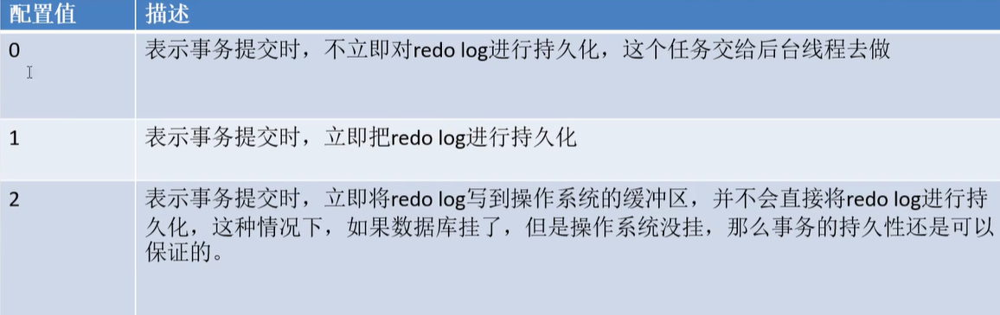


0：存入 Log Buffer，定时 flush。应用场景：commit 会更快，针对哪些数据可能丢失也没关系的场景

1：存入 Log Buffer后，立即flush。

2：write到操作系统缓冲区，由操作系统定时flush。

* 在 Java 中也是一样的，在 write 写入时，是先写到操作系统的内存中，然后通过 flush 持久化动作。


### DoubleWrite Buffer

双写缓冲区，是在磁盘中的。

InnoDB 要将数据写入磁盘，需要通过操作系统执行。问题在于，一个InnoDB 数据页 16KB，而操作系统一次读写的大小是 4kb（单位是页，4KB是磁盘的限制？）。假设在写入一半时，操作系统断电，已经写入磁盘的数据就是脏数据了

执行流程：

1. InnoDB 将数据先写入到 Double Buffer 。
2. 若中途断电等发生，表空间的数据不受影响
3. 当mysql 启动时，mysql 通过 redo log 和 表空间来恢复数据
4. 当再次从 InnoDB 写入磁盘
5. 若这次成功写入了 Double Buffer ，则会删除对应的 redo log
6. Double Buffer 会写入到 表空间
7. 若中途断电等发生
8. mysql 重启，会直接从 Double Buffer 中读取数据


> 性能调优

双写磁盘会有应能问题，但这套方案解决了数据丢失的问题。

当硬件能支持原子性操作，那么可以去除 Double Buffer 机制


执行流程


优化策略分析


子主题


## 存储引擎 Myisam

MYISAM 对应的文件
*.frm - frame：表结构
*.MYD -数据文件 —— MY是 Myisam 缩写，D 表示 data
*.MYI 索引文件 —— I 表示 index 索引，就是 B+ 树，如下

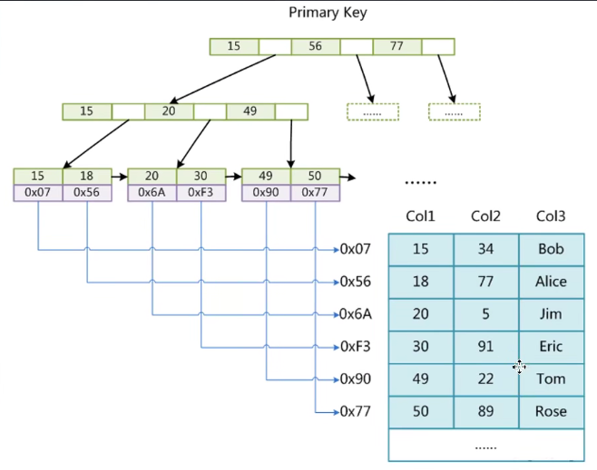	

> 查找执行口述

1. 检查where 条件是否有索引
2. 若有，则读取 MYI 索引文件，定位到索引元素，索引元素对应的data元素，索引所在行的文件磁盘地址
3. 然后读取 MYD 去获取数据


Myisam 的特点

* 不支持事务
* 不支持行锁（支持表锁）
* 不支持外键
* 应用场景：执行大量的 select


## 存储引擎 Memory


特点

* 数据存储内存，表结构存储磁盘，访问效率高
* 服务关闭，表中数据丢失
* 应用场景：Mysql 内存表做数据缓存


## binlog

MySQL 的概念

binlog 的思想与 InnoDB 的 redo log 思想是一致的

|          | binlog                    | InnoDB redo log                          |
| -------- | ------------------------- | ---------------------------------------- |
| 日志内容 | sql 语句                  | sql 语句、记录页中相关信息，恢复效率更高 |
| 日志空间 | 不会被清掉， 用于主从复制 | 会被清掉                                 |
|          |                           |                                          |


binlog 场景：

主从复制


## 事务


#### 执行流程

1. 开启事务
2. update 语句等，修改 Buffer Pool 页
3. 生成 redo log 对象到 log buffer
4. binlog 持久化
5. undo log 中记录反向操作，持久化
6. 修改成功
7. redo log 持久化（事务提交时）
8. rollback 回滚，读取 undo log，执行 undo log 的语句


#### Undo Log


#### 事务隔离级别

四种隔离级别是标准规范，需要由各个服务器厂商实现：

* 读未提交：一个事务还没提交时，它做的变更就能被别的事务看到
* 读已提交（Oracle默认）：一个事务提交后，它做的变更才会被其他事务看到
* 可重复读（MySQL默认）：一个事务执行过程中看到的数据，总是跟这个事务在启动时看到的数据一致
* 串行化：对于同一记录，对读和写分别加锁。当发生读写冲突时，后访问事务必须等前一个事务执行完成


==mysql 没有幻读==：mysql 通过 MVCC + 锁，避免了幻读。


> 执行流程

假设有多个客户端都开启了事务

* 每个事务都有一个事务id
* readview 会记录当前正活动的事务id
* 事务发生写操作，会记录反向操作的 undo log，在undo log 中记录了事务id和改之前的值
* 这一切都发生在内存中

此时又有一个客户端进行 select 操作，不同的事务隔离级别，会导致查询的结果不同

* 可重复读；每次读取相同的 readview 
* 


## MVCC


通过执行流程来解构知识点


### 版本链


### ReadView

数组结构，记录了当前活跃的（未提交、未回滚）事务ID（除去自身）。

不同隔离级别生成 readview 的时机不同

* 可重复读：第一次 select 时生成 readview，后续不管readview 中记录的事务是否提交，当前事务的readview 不受影响。
* 读已提交：每次 select 会重新获取活跃的事务ID 生成到 readview 中。


### Undo Log

链表结构

当正活跃的事务进行写操作时，会生成一条 undo log 记录插入在首部，内容包含：1）事务id；2）反向操作 sql。


### 执行流程


可重复读：

当前事务在 select 时，若发现有 undo log，会对 undo log进行遍历，将 undo log 节点中的 事务id 与 自身 readview 中记录的事务ID 相匹配，若一致则执行“恢复”。这个恢复仅当前事务可见。


读已提交：

当前事务在 select 时，会从 undo log 中找到最近被提交的事务（当undo log 记录的id不在自己的readview中，则表示该事务id 已提交），已该事务的值作为查询结果。


### 核心问题


### 实现


### 


----------------


例如两个 sql ，要么都成功，要么都失败


并发事务带来的问题

* 丢失更新
* 脏读
* 不可重复读：读到已提交更新的数据，但一个事务范围内两个相同的查询却返回了不同数据
* 幻读：读到已提交插入的数据


隔离级别

* 未提交读
    * 允许脏读
* 提交读
* 可重复读（默认）
    * 可重复读
    * 在SQL标准中还存在幻读，但MySql中已解决幻读
* 串行读


## 性能调优

若服务器内存足够大，可以调整 Buffer Pool 的大小，存放足够多的热数据区域。


## JDBC


### 数据库驱动

> 怎么理解硬件驱动？

平时计算机中的驱动程序是硬件驱动程序

CPU要与IO模块传送数据，要编程，这个与IO模块传送数据的程序就是"驱动程序"。

驱动程序的本质，就是与IO模块传送数据的程序

驱动程序（Device Driver）全称为“设备驱动程序”，是一种可以使计算机和设备通信的特殊程序，可以说相当于硬件的接口，操作系统只能通过这个接口，才能控制硬件设备的工作

>怎么理解JDBC 驱动？

JDBC驱动程序实现JDBC API定义的接口和数据库服务器交互。本质是个 socket 。


> JDBC 为何一套语法能够搞定多个数据库

在没有 JDBC 前，java 连接数据库，有几种不同的数据库，就需要导入几个驱动包，且写不同的程序代码

JDBC：为了简化开发人员的操作，对数据库的统一操作，提供了一个 Java操作数据库的规范。对于开发人员只需要掌握 JDBC 的接口操作即可。

JDBC 的规范统一了不同数据库厂商的不同驱动。

	


==相关的包==

* java.sql
* javax.sql
* 数据库驱动包 mysql-connector-java-5.1.49.jar


### JDBC 程序


> 创建测试数据库

```sql
CREATE DATABASE jdbcStudy CHARACTER SET utf8 COLLATE utf8_general_ci;

USE jdbcStudy;

CREATE TABLE `users`(
id INT PRIMARY KEY,
name VARCHAR(40),
password VARCHAR(40),
email VARCHAR(60),
birthday DATE
);

INSERT INTO `users`(id,name,password,email,birthday)
VALUES(1,'zhansan','123456','zs@sina.com','1980-12-04'),
(2,'lisi','123456','lisi@sina.com','1981-12-04'),
(3,'wangwu','123456','wangwu@sina.com','1979-12-04')
```


> IDEA 导入 驱动 jar 包（不用maven的情况下）

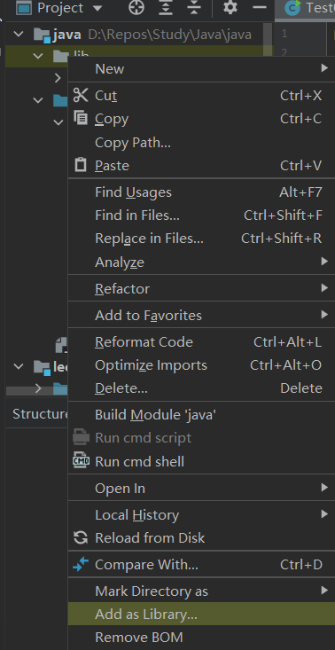	


> 第一个程序

```java
public class JdbcFirstDemo {
    public static void main(String[] args) throws Exception {
        //1. 加载驱动
        Class.forName("com.mysql.jdbc.Driver");//固定写法
        //2. 用户信息和url
        //useUnicode=true&characterEncoding=utf8&&useSSL=true
        String url ="jdbc:mysql://1.117.139.73:3306/jdbcStudy?useUnicode=true&characterEncoding=utf8&&useSSL=false";
        String name = "xincan";
        String password = "]~P(Xmt;[LO3";

        //3. 连接成功，返回数据库对象  connection代表数据库
        Connection connection= DriverManager.getConnection(url,name,password);
        //4. 执行SQL的对象 statement 执行SQL的对象
        Statement statement = connection.createStatement();

        //5. 执行SQL的对象 去执行SQL   可能存在结果，查看返回结果
        String sql="SELECT * FROM users";
        ResultSet resultSet = statement.executeQuery(sql);//返回的结果集,结果集中封装了我们全部查询的结果
        while(resultSet.next()){
            System.out.println("id+"+resultSet.getObject("id"));
            System.out.println("name+"+resultSet.getObject("NAME"));
            System.out.println("password+"+resultSet.getObject("PASSWORD"));
            System.out.println("email+"+resultSet.getObject("email"));
            System.out.println("birthday+"+resultSet.getObject("birthday"));
        }
        //6. 释放连接
        resultSet.close();
        statement.close();
        connection.close();
    }
}
```


步骤总结：

1. 加载驱动
2. 连接数据库 DriverManager
3. 获取执行SQL的对象 Statement
4. 获得返回的结果集
5. 释放连接


### JDBC 中对象解释

> 加载驱动

Class.forName("com.mysql.jdbc.Driver")，这条语句的确是反射加载类，而这种Class.forName的写法会触发静态块里的内容。

```java
static {
    try {
        java.sql.DriverManager.registerDriver(new Driver());
    } catch (SQLException E) {
        throw new RuntimeException("Can't register driver!");
    }
}
```

在这里用静态代码块的好处是保证只加载一次


```java
private final static CopyOnWriteArrayList<DriverInfo> registeredDrivers = new CopyOnWriteArrayList<>();
```


> DriverManager

```java
//DriverManager.registerDriver(new com.mysql.jdbc.Driver());
Class.forName("com.mysql.jdbc.Driver");//固定写法
Connection connection= DriverManager.getConnection(url,name,password);

//connection代表数据库
//数据库设置自动提交
//事务提交
//事务回滚
connection.rollback();
connection.commit();
connection.setAutoCommit();
```


> URL

```JAVA
String url ="jdbc:mysql://localhost:3306/jdbcstudy?useUnicode=true&characterEncoding=utf8&&useSSL=false";

//mysql 默认3306
//协议://主机地址:端口号/数据库名？参数1&参数2&参数3

//Oracle   1521
//jdbc:oralce:thin:@localhost:1521:sid
```


>statement 执行SQL的对象 	PrepareStatement 执行SQL的对象

```JAVA
String sql="SELECT * FROM users";//编写Sql

statement.executeQuery(); // 查询操作
statement.execute(); // 执行任何 SQL
statement.executeUpdate();//更新，插入，删除，返回一个受影响的行数
```


> ResultSet 查询的结果集，封装了所以的查询结果

```java
// 只有查询才返回 ResultSet
ResultSet resultSet = statement.executeQuery(sql);//返回的结果集,结果集中封装了我们全部查询的结果
resultSet.getObject();//在不知道列类型下使用
resultSet.getString();//如果知道则指定使用
resultSet.getInt();
```


> 遍历、指针

```java
resultSet.next(); //移动到下一个
resultSet.afterLast();//移动到最后
resultSet.beforeFirst();//移动到最前面
resultSet.previous();//移动到前一行
resultSet.absolute(row);//移动到指定行
```


>释放内存

```java
//6. 释放连接
resultSet.close();
statement.close();
connection.close();//耗资源
```


> 工具类

```java
public class JdbcUtils {
    private static String driver = null;
    private static String url = null;
    private static String username = null;
    private static String password = null;

    static {
        try {
            InputStream in = JdbcUtils.class.getClassLoader().getResourceAsStream("db.properties");
            Properties prop = new Properties();
            prop.load(in);
            driver = prop.getProperty("driver");
            url = prop.getProperty("url");
            username = prop.getProperty("username");
            password = prop.getProperty("password");
            System.out.println("url = " + url);
            // 驱动只用加载一次
            Class.forName(driver);

        } catch (IOException e) {
            e.printStackTrace();
        } catch (ClassNotFoundException e) {
            e.printStackTrace();
        }
    }

    // 获取连接
    public static Connection getConnection() throws SQLException {
        return DriverManager.getConnection(url, username, password);
    }

    // 释放连接
    public static void release(Connection connection, Statement statement, ResultSet resultSet) {
        if (resultSet != null) {
            try {
                resultSet.close();
            } catch (SQLException throwables) {
                throwables.printStackTrace();
            }
        }
        if (statement != null) {
            try {
                statement.close();
            } catch (SQLException throwables) {
                throwables.printStackTrace();
            }
        }
        if (connection != null) {
            try {
                connection.close();
            } catch (SQLException throwables) {
                throwables.printStackTrace();
            }
        }
    }
}
```


```java
public class TestInsert {
    public static void main(String[] args) {
        Connection connection = null;
        Statement statement = null;
        ResultSet resultSet = null;

        try {
            connection = JdbcUtils.getConnection(); // 数据库对象
            statement = connection.createStatement(); // 语句对象
            String sql = "INSERT INTO users(id,`NAME`,`PASSWORD`,`email`,`birthday`)" +
                    "VALUES(5,'sanjin','123456','233223@qq.com','2020-01-01')";

            int i = statement.executeUpdate(sql);
            if(i>0){
                System.out.println("插入成功");
            }
            JdbcUtils.release(connection, statement, resultSet);
        } catch (Exception e) {
            e.printStackTrace();
        }
    }
}
```


### PreparedStatement对象

PreparedStatement 可以防止SQL注入 ，效率更高。


### JDBC 事务

> ACID原则

原子性：要么全部完成，要么都不完成

一致性：结果总数不变

隔离性：多个进程互不干扰

持久性：一旦提交不可逆，持久化到数据库了

隔离性的问题：

脏读： 一个事务读取了另一个没有提交的事务

不可重复读：在同一个事务内，重复读取表中的数据，表发生了改变

虚读（幻读）：在一个事务内，读取到了别人插入的数据，导致前后读出来的结果不一致


## 锁


### 锁粒度


#### 行级锁


#### 表级锁


#### 页级锁


### 是否独占


#### 读锁（共享锁）

阻塞写


#### 写锁（排他锁）

阻塞读、写
